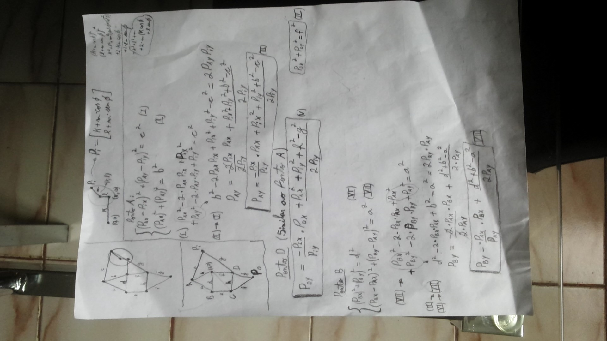
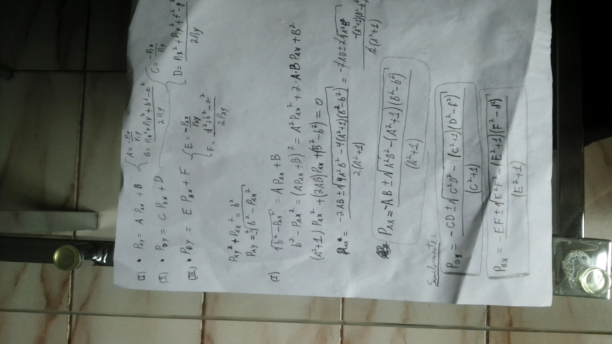
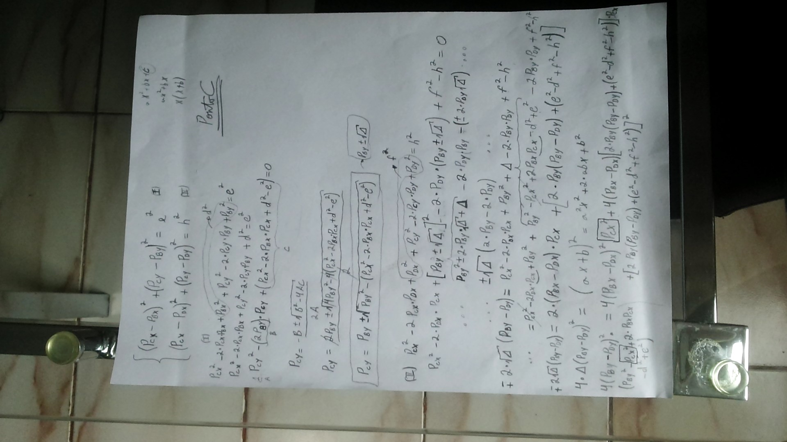
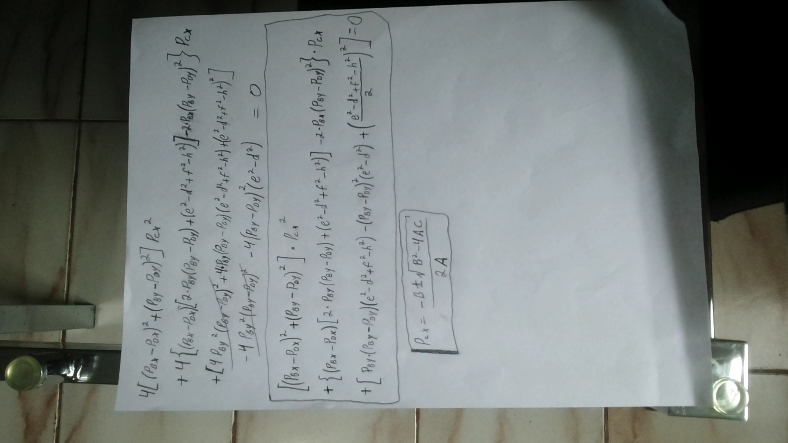
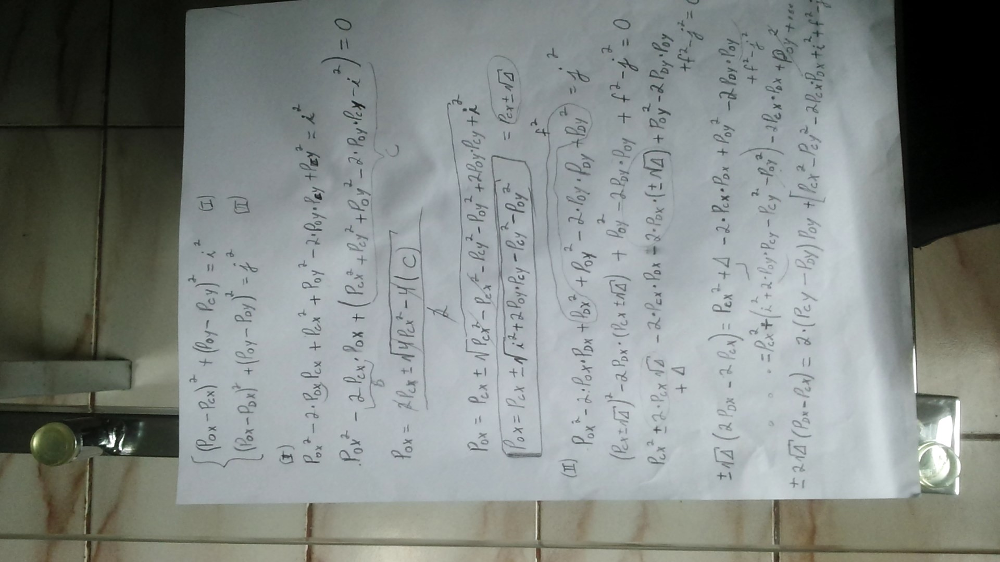
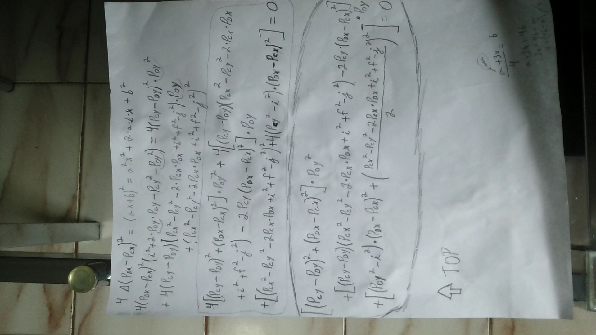

I'm a big fan of Theo Jansen. Can you see the beauty of his creations? Watch this:

Ok.. He did it with an Atari computer in 1990! I want to reproduce this...

First of all, I need to calculate the mechanism kinematics. Here is my calculations:

For now, the python code only plots the kinematics results. 